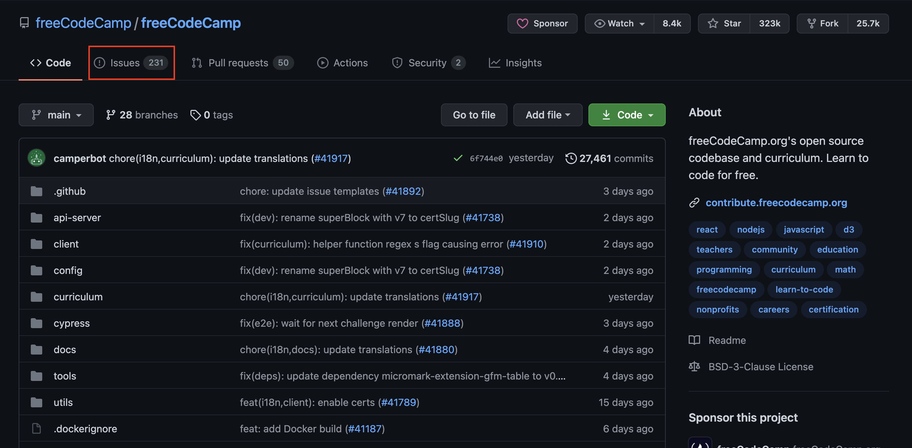
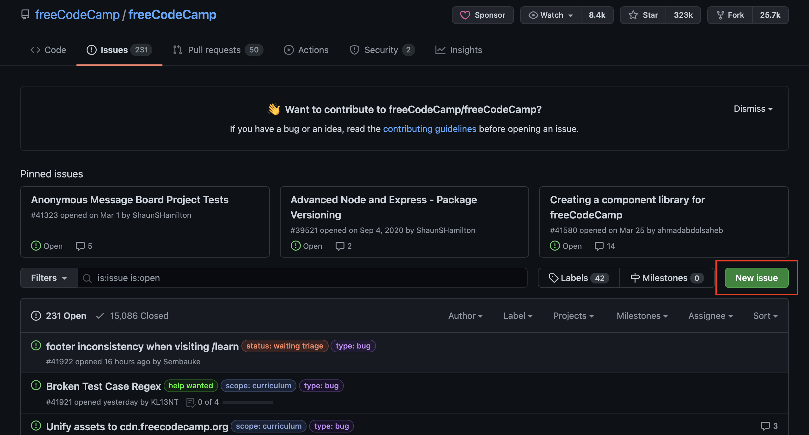
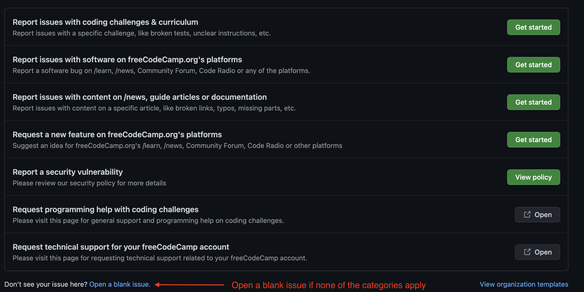

# How to Open an Issue

Issues are created when a bug is found. This guide will help you in creating a new issue within FreeCodeCamp's repository on GitHub.

## Before Creating an Issue

In order to verify that a bug has been found, please do the following:

1. If you are working on a coding challenge, try clicking the "Reset All Code" button. It's possible that you made changes to the code for the challenge. This will reset any changes made to the challenge code present on the page.
2. Try performing a hard refresh of the page. The command for hard refreshing the page is as follows:
   - For Windows users: CTRL + F5
   - For Mac users: Command + Shift + R
   - For Linux users: F5
3. You can ask other community members about the problem you experienced in one of FreeCodeCamp's Chat Rooms. More information can be found [here](https://forum.freecodecamp.org/t/how-to-get-help-on-gitter/19130).
4. Search FreeCodeCamp's forums to see if the bug has been encountered by someone else. If you cannot find any discussions about the problem encountered, you may also post a question on one of the forums. FreeCodeCamp's forums can be found [here](https://forum.freecodecamp.org/).
5. If a solution to the bug is not found by following the previous steps, browse the issues within FreeCodeCamp's repository to determine if an issue has already been opened surrounding this bug. You can find the currently opened issues [here](https://github.com/freeCodeCamp/freeCodeCamp/issues).
6. If an issue has not yet been created, then follow the steps below to to create a new issue.

## Creating a New Issue

1. While at the [FreeCodeCamp repository](https://github.com/freeCodeCamp/freeCodeCamp), click on the "Issues" link located directly below the name of the repository.

2. Upon clicking the link, you will be taken to the page where you can view open issues as well as create new issues. Click on the "New issue" button.

3. On this page, you will be shown different categories for issues to choose from. Select the category that best represents what bug you have found and click the "Get started" button. If none of the categories are applicable, you can also open a blank issue.

4. You will be redirected to a form that you will use to report the bug.
   - First select the title for your issue. This title should be descriptive but also brief.
     - A descriptive title would be something such as "'Settings' link in the dropdown Menu not working"
     - A title that is not descriptive would be something such as "Problem found on FreeCodeCamp's website"
   - Next, add a description for the bug found. Within the description text box, prompts on what to write are made available to you. These prompts include:

     - Listing the affected page. Please include a link to the page.
     - If you were working on a challenge, please post the code that you used within three backticks such as this:

       \`\`\`
       Your code here
       \`\`\`

     - Add a description about the behavior you expected to happen.
     - You may add screenshots to show any relevant behavior of the bug. The image can be dragged directly into the description box.
     - Describe the system that you experienced this bug on. Relevant information includes:
       - Device name
       - Operating system
       - Browser
       - Device version
     - Add any other relevant information related to the problem experienced.

   - After all information is filled out, click the "Submit new issue" button.
5. Once the issue has been submitted, other community members will post their thoughts about the issue or offer suggestions on how to fix it. Some may also offer to fix the issue. You will be notified of any new comments on your opened issue.
